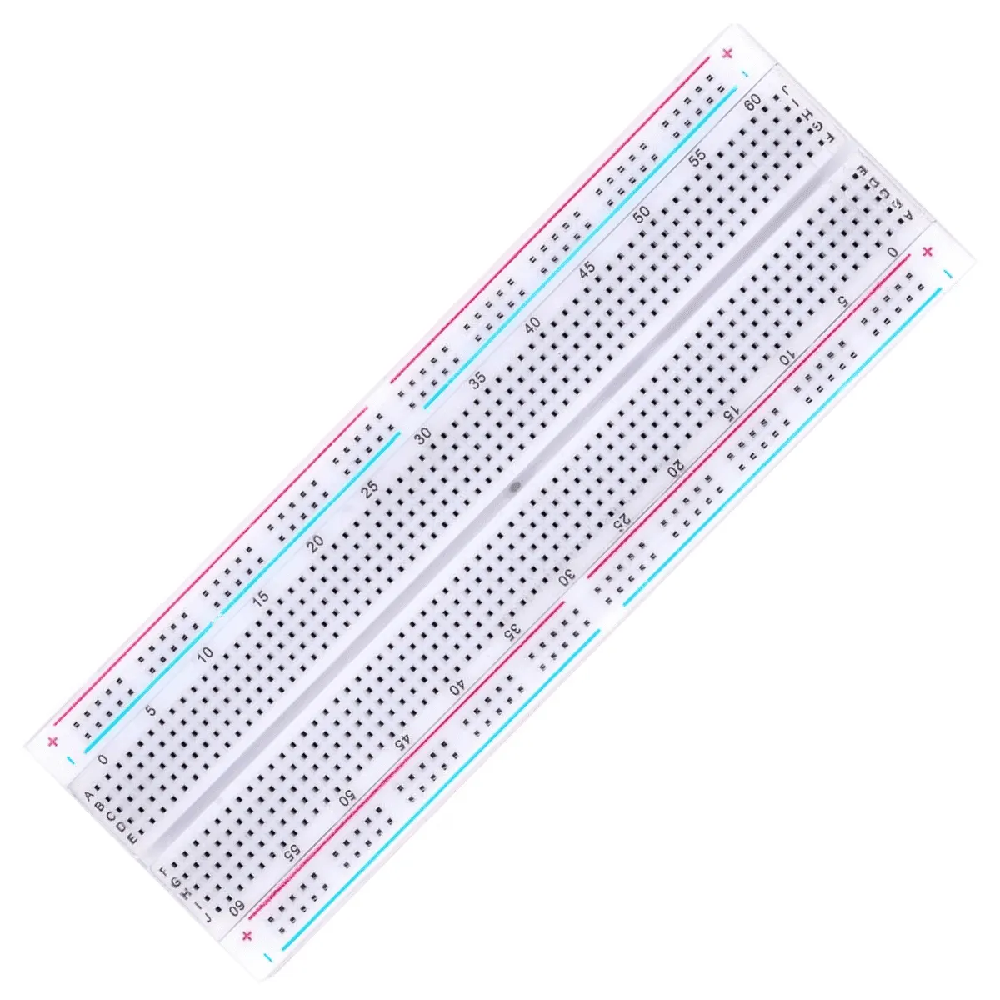
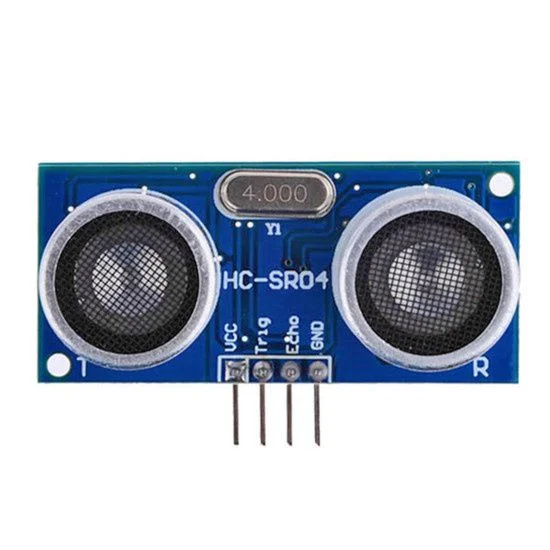
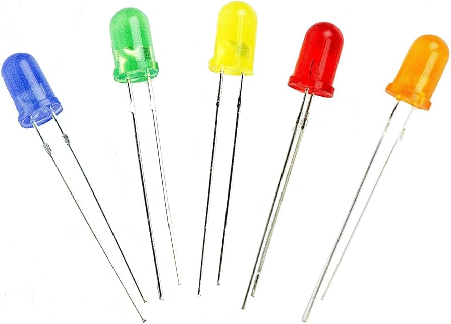
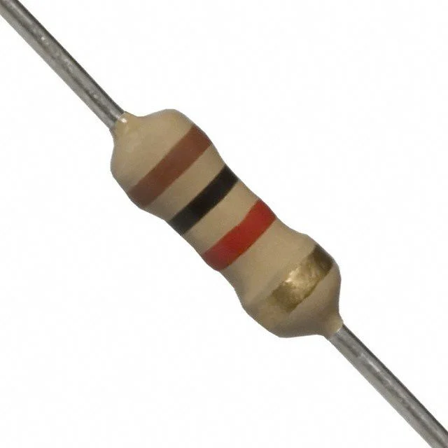
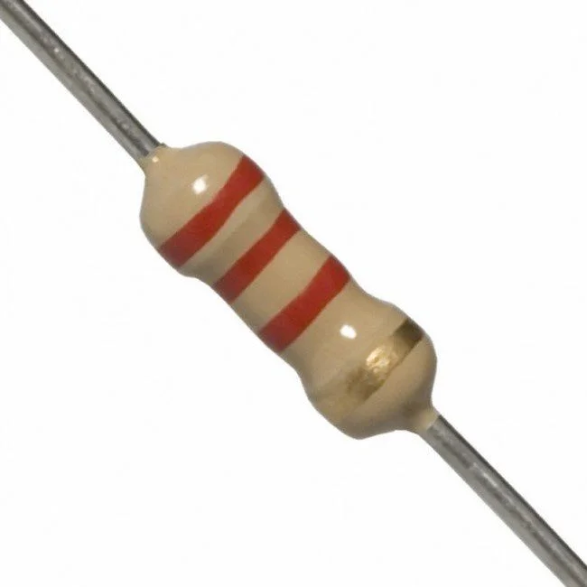
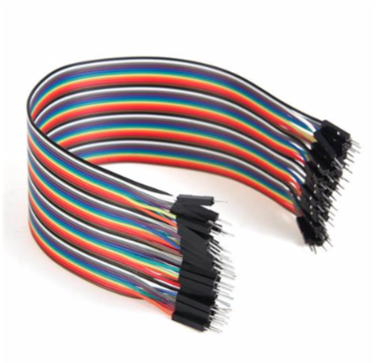
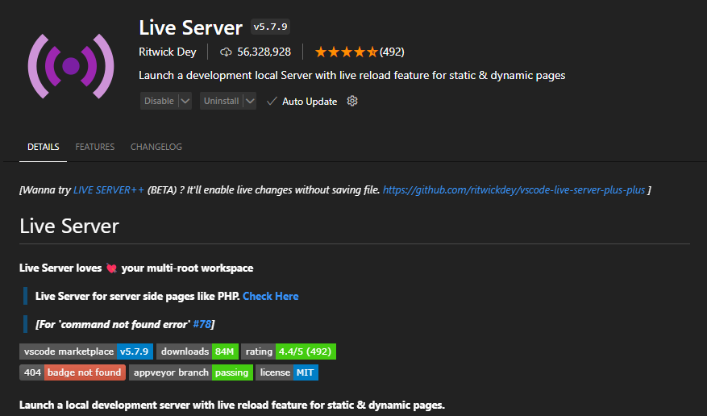
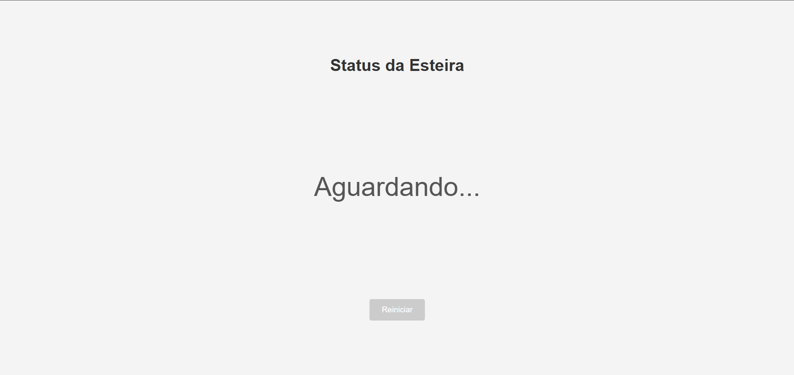
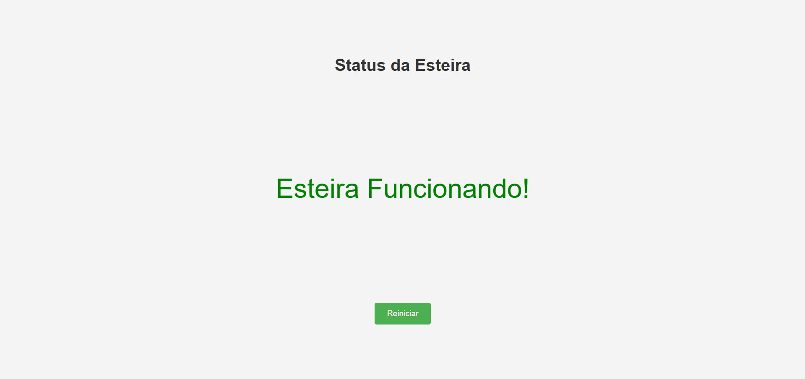
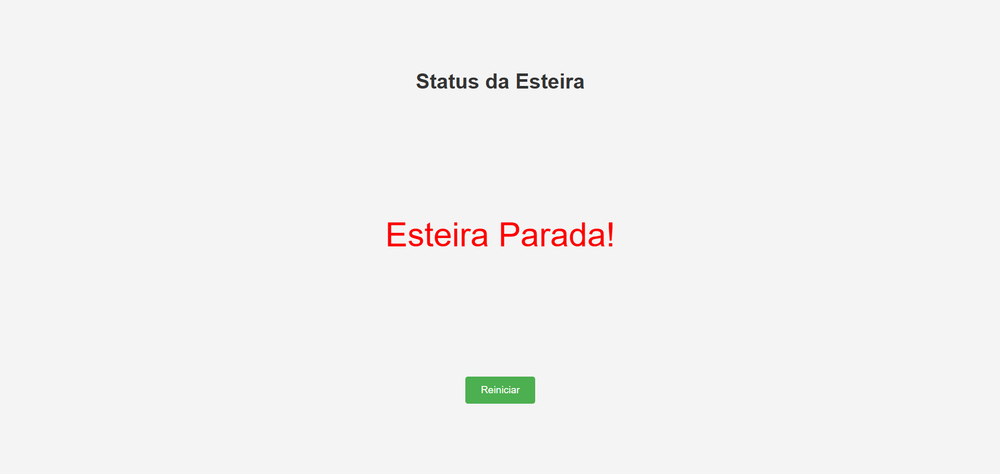

<p align="center">
  <a href="https://www.mackenzie.br/" target="blank"></a>
</p>

<div align="center" >

<p>Esse é o projeto final da matéria Objetos Inteligentes Conectados da Universidade Presbiteriana Mackenzie.</p>

<p><strong>GRUPO X - ALUNOS:</strong></p>

<p>João Pedro Mantovani Dantas de Souza
<br>João Pedro Ribeiro
<br>Rebeca Vieira Barbosa
</p>

</div>

## Hardware Utilizado

<div style="display: flex; justify-content: center; gap: 20px; margin-bottom: 20px;">
  <div style="text-align: center;">
    <p>1- Raspberry Pi 3 Model B - 1 Unidade</p>
    
  </div>
  <div style="text-align: center;">
    <p>2- Protoboard - 1 Unidade</p>
    
  </div>
  <div style="text-align: center;">
    <p>3- Sensor Ultrassonico (HC-SR04) - 1 Unidade</p>
    
  </div>
</div>

<div style="display: flex; justify-content: center; gap: 20px; margin-bottom: 20px;">
  <div style="text-align: center;">
    <p>4- Led (vermelha e verde) - 2 Unidades</p>
    
  </div>
  <div style="text-align: center;">
    <p>5- Resistor 1KΩ - 3 Unidades</p>
    
  </div>
  <div style="text-align: center;">
    <p>6- Resistor 2.2KΩ - 1 Unidade</p>
    
  </div>
</div>

<div style="text-align: center;">
  <p>7- Jumpers variados</p>
  
</div>

## Conexões do Hardware

As conexões necessárias para o projeto funcionar são as seguintes:

### Energia

Conecte o pino 2 do raspberry pi na trilha positiva da protoboard e o pino 6 na trilha GND.

### HC-SR04

```
1- Pino VCC ligado a trilha 5V da protoboard;

2- Pino GND ligado na trilha GND da protoboard;

3- Pino TRIG ligado no GPIO 23 do raspberry;

4- Pino ECHO volta uma corrente 5V, mas o pino do raspberry só aceita 3.3 de maneira segura, então temos que fazer uma redução de carga com um resistor de 1K Ohms e um de 2K Ohms para que os 5V virem 3. O pino ECHO então se conecta a uma trilha da protoboard, onde terá um resistor de 1k. Esse resistor de 1k vai levar a carga até outra trilha, onde terá um resistor de 2k ligado a trilha GND. Entre esses dois resistores colocaremos um jumper que se conectará na GPIO 24 do raspberry.
```

### Leds

As leds tambem precisam de um resistor para funcionarem bem.

- Led Verde:

```
1- Conecte o catodo (perna mais curta, negativo) do LED ao GND.

2- Conecte o anodo (perna mais longa, positivo) ao GPIO 22 através de um resistor de 1K Ohms (com o de 330 ela vai brilhar mais)
```

- Led Vermelha:

```
1- Conecte o catodo (perna mais curta, negativo) do LED ao GND.

2- Conecte o anodo (perna mais longa, positivo) ao GPIO 27 através de um resistor de 1K Ohms (com o de 330 ela vai brilhar mais)
```

## Rodando localmente

### Script do Raspberry

!! Utilizamos um Raspberry Pi 3 B com o RaspOS modo texto. Esse tutorial se baseará nisso, para outros dispositivos como o Arduino é provável que seja necessário mudanças !!

1- Primeiro de tudo precisamos instalar as dependencias em nosso sistema operacional.

- Instalar o mosquitto para o MQTT

```bash
$ sudo apt install mosquitto mosquitto-clients
```

- Instalar as bibliotecas python

```bash
$ sudo apt install python3-rpi.gpio
$ sudo apt install python3-paho-mqtt
```

- Como estamos utilizando WebSockets precisamos fazer algumas edições nas configurações do Mosquitto, alem disso vamos utilizar o allow_anonymous para não precisar se credenciar no envio das mensagens.

Então para acessar as configuracoes do mosquitto o comando é o seguinte:

```bash
$ sudo vim /etc/mosquitto/mosquitto.conf
```

Dentro do arquivo coloque as seguintes configurações:

```bash
listener 1883
listener 9001
protocol websockets
allow_anonymous true
```

- Após adicionarmos as mudanças no arquivo de configuração do mosquitto, basta iniciar o serviço.

```bash
$ sudo systemctl enable mosquitto
$ sudo systemctl start mosquitto
```

PS: caso o arquivo de configuração não exista na hora de editar, inicie o serviço primeiro e reinicie após alterar as configurações com o comando abaixo

```bash
$ sudo systemctl restart mosquitto
```

- Com todas as alterações feitas, você deve precisar alterar duas coisas no código raspberry.py
  <br>A primeira é o valor da variavel MQTT_BROKER, nela coloque o IP do seu raspberry PI. Para ver o IP de o comando abaixo:

```bash
$ hostname -I
```

A segunda é verificar se as suas conexões fisicas com os pinos GPIO estão corretas e caso necessário é possivel alterar no código também.

```bash
TRIG_PIN = 23 → Pino físico 16
ECHO_PIN = 24 → Pino físico 18
GREEN_LED = 22 → Pino físico 15
RED_LED = 27 → Pino físico 13
```

- Após as configurações e as validações, basta iniciar o script com o comando abaixo:

```bash
$ python3 raspberry.py
```

### Portal Web

- Para iniciar o portal web você pode utilizar o sistema que preferir. Utilizamos a extensão "Live Server" do Visual Studio Code para executa-lo. Vale lembrar que é necessário estar na mesma rede que o seu raspberry PI para funcionar.



<br>
- Você também irá precisar alterar no arquivo monitoring.js o valor da variavel ipRasp para o IP do seu raspberry PI.

## Client Mobile

Além da web, também é possivel utilizar um client mobile como o app MyMQTT para receber as filas, com isso dá para montar algumas automações ou notificações.

[Assista ao vídeo de uma demonstração do client mobile aqui!](https://www.youtube.com/shorts/RZqFC__Eo0c)

## Video do Projeto Rodando

[Assista ao vídeo do nosso projeto rodando aqui!](https://www.youtube.com/watch?v=n_9yES4eJCk)

## Imagens Projeto Feito

<p align="center">
  
  
  
  
  
  
  
</p>
